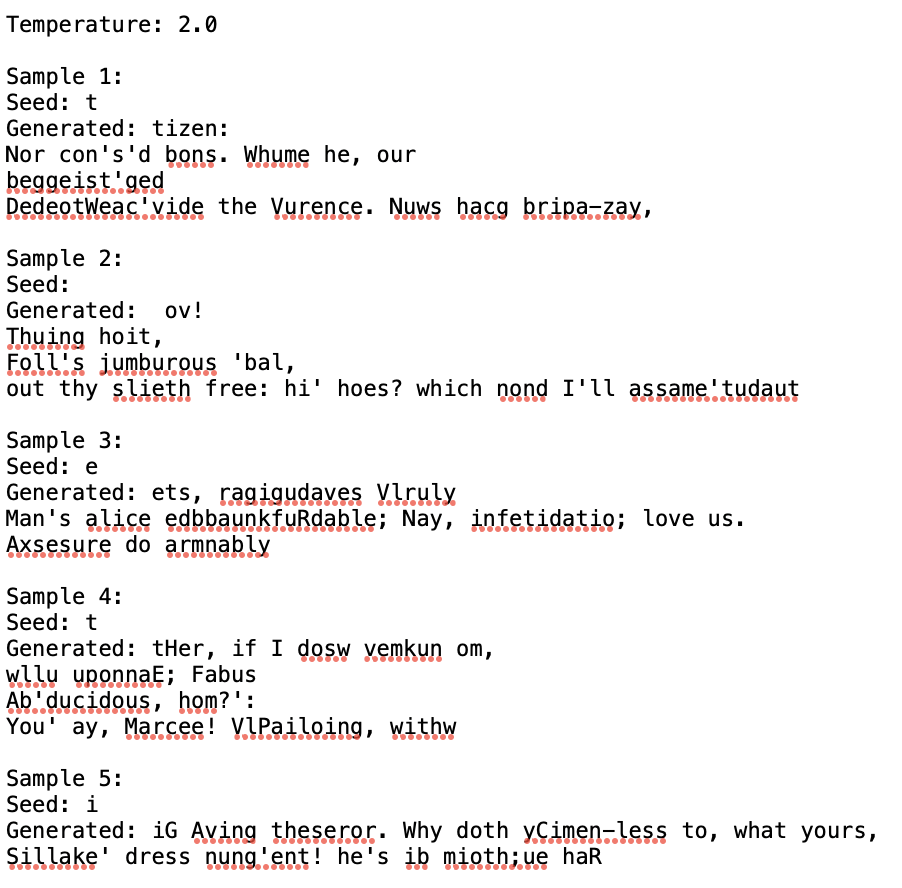

# Language_Modeling

인공신경망과 딥러닝

Assignment #3

24510101 김상훈

shkim@ds.seoultech.ac.kr

# Abstract
This assignment implements two neural networks, **RNN and LSTM, for character-level language modeling using the Shakespeare dataset.** Both models will be trained and then used to generate samples of length 100. 

This report presents two main results:

(i) a comparison **graph of the train and validation losses** for both models over the training period 

(ii) an analysis of the **impact of varying the softmax parameter $T$** on text generation.

# Report
Before looking at the main results, let's review the key contents of each *.py* file and the parts that implement the requirements.

## dataset.py

### Requirements Met:
- **Character Indexing**: Constructs a dictionary mapping characters to indices and vice versa.
- **Sequence Preparation**: Splits the text data into sequences of length 30, with corresponding targets.

## model.py

### Description:
- **Architecture**: The RNN is composed of a single layer, while the LSTM consists of two layers.

### Additional Techniques:
- **Dropout**: The LSTM automatically applies recurrent dropout when dropout is used in the package, therefore, a dropout of 0.3 is applied.

## main.py

#### Requirements Met:
- **Detailed Settings**: The batch size is set to 64, hidden size to 256, and the optimizer used is Adam. The cost function employed is CrossEntropyLoss, and SubsetRandomSampler is used to create these DataLoaders.
- **Plotting**: Generates loss curves for both models
  
#### Additional Techniques:
- **Early Stopping Implementation**: Includes early stopping to prevent overfitting.

## generate

#### Requirements Met:
- **Seed and Sample Length**: Using the higher-performing LSTM, five text generation samples of length 100 with different seed characters were created.
- **Parameter Experiment**: The impact of varying the softmax parameter $T$ at 0.5, 1.0, and 2.0 was compared.

## Plots of loss values

Training was halted by early stopping at epoch 18 for the RNN and epoch 26 for the LSTM.

**Although both models showed similar training tendencies** and final train loss performance, **the LSTM exhibited a much lower and more stable validation loss curve.**

## Influence of the softmax parameter $T$ variation on text generation

## Overview
This subsection investigates the impact of varying the temperature parameter $T$ in the softmax function during text generation with an LSTM. 

### Methodology
- **Model**: LSTM trained on the Shakespeare dataset.
- **Temperature Settings**: Three settings were chosen to represent low (0.5), medium (1.0), and high (2.0) diversity.
- **Data**: 5 Samples generated from the model at each temperature setting using different seed characters.

### Results

With $T$ = 0.5, the generated text is **more conservative and tends to be more coherent and predictable.** It closely mimics the style and structure of Shakespeare's original texts.

- **Examples**:
  - "now the people, And see it as you have deserved his eyes to his country."
  - "so see him to the people, Where the gods for the loved thou art the time, that we cause all the end,"

With $T$ = 1.0, there's a **balance between randomness and adherence** to the training data structure. 

The outputs are moderately coherent but introduce a greater variety of word choices and sentence structures.

- **Examples**:
  - "ishadions of him to hage of otself; and, it ended to us I much banish'd, but this from their dulls be"
  - "flace. I must not Clarence, Bear me but his mother with this ladies ase, devil Marcius, But still by"

With $T$ = 2.0, the model produces **very diverse and creative** text outputs, often at the cost of reduced coherence and grammatical correctness.

- **Examples**:
  - "tizen: Nor con's'd bons. Whume he, our beggeist'ged DedeotWeac'vide the Vurence. Nuws hacg bripa-zay,"
  - "ov! Thuing hoit, Foll's jumburous 'bal, out thy slieth free: hi' hoes? which nond I'll assame'tudaut"

### Conclusion
The temperature parameter $T$ plays a critical role in controlling the diversity of the generated text in LSTM models. **Lower temperatures result in more predictable** and coherent text, while **higher temperatures encourage creativity** at the expense of grammatical and logical structure.

**The key to generating plausible text lies in adjusting $T$ to balance predictability and creativity**, tailored to the text's purpose—lower temperatures for factual accuracy and higher for creative expression.
